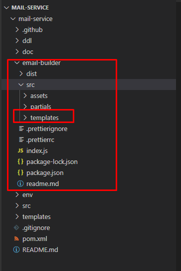

# mail service

> The mail service is mainly used to control the templates sent to users and employees.

`As below image show, the email-builder is the main template module, we can edit template in html files with nunjucks. After template complete, we can build the html files to normal vm files, which need upload in mail service page.`



`example of template html`
```html





<title>Order Modification Notification</title>



<tr>
  <td><table width=100% border="0" cellspacing="0" cellpadding="0">
      <tr>
        <td style="background-color: #fff; padding: 0; font-size: 14px; font-family: sans-serif; color: #000000;">
          Dear Coordinator,<br /><br />
          Please be informed the order $!{order.orderNumber} done by the following client $!{client.companyName} was modified.<br /><br />
          The modifications involve the following information:<br /><br />
          {# Service Date: Initially 12-August-2021 – Updated 15-August-2021] #}
          {# Status: Initially Waiting for inspection – Updated Waiting for allocation] #}
          <b>$!{modificationDetail}</b><br /><br />
          Please check and update, if necessary, the order allocation based on the updated information.<br /><br />
        </td>
      </tr>
    </table>
  </td>
</tr>
<tr>
  <td
    style="background-color: #fff; padding: 0; font-size: 14px; font-family: sans-serif; color: #000000;">
    <br> For any further queries and assistance, please contact us.<br />
  </td>
</tr>

```